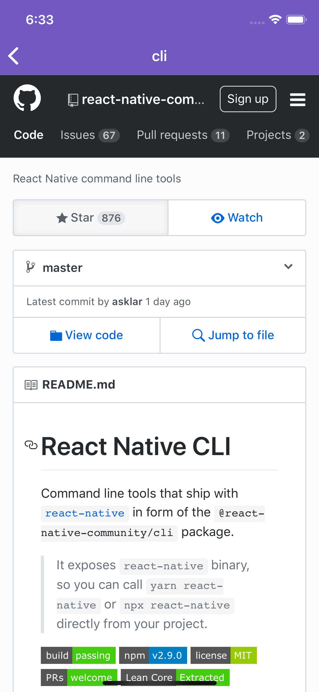

# github-api-mobile
Consuming GitHub API with React Native

<p float="left">
  
  
  
</p>

## Setup

```bash
yarn

# ios
react-native run-ios --simulator "iPhone X"

# android
react-native run-android
```

## Features
- [x] Styled Components
- [x] Reactotron
- [x] WebView
- [x] Eslint + prettier + EditorConfig
- [x] Navigation
- [x] Api calls
